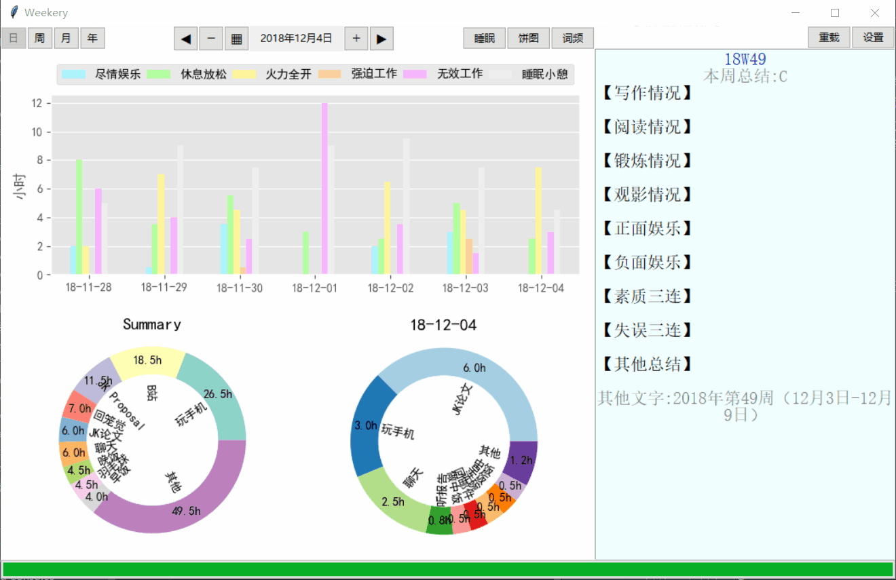
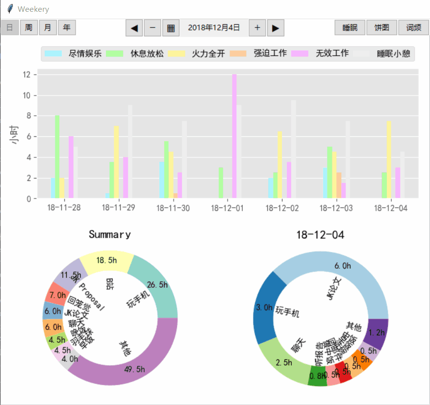
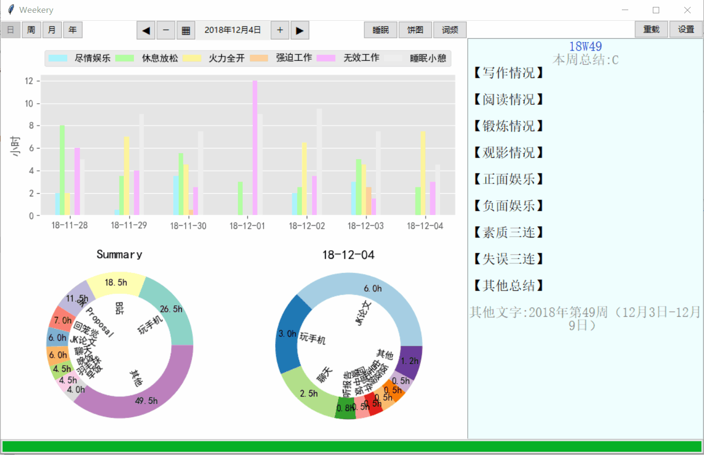

# WizStatistics

基于**wiz**用**Python**构建的时间记录软件。 
 

## 功能

### TO DO

- [x] 时长展示
- [x] 图像界面
- [x] 睡眠分析
- [ ] 官网制作
- [ ] 更新检查
- [ ] 发送错误报告
- [ ] 自动化创建模板
- [ ] 词频分析
- [ ] 功能设置

## 如何使用

### 1.软件安装

1. 安装[为知笔记](www.wiz.cn) 

1. **下载**模板文件[WeekeryTemplate.wiztemplate](https://github.com/HowcanoeWang/WizStatistics/releases/download/Beta0.2/WeekeryTemplatev4.0.wiztemplate)并**导入**为知笔记
    

    
1.  设置模板，点击模板文件在编辑界面点分享按钮另存为模板。

 

### 2.建立项目
1. **新建**周记文件夹，**My Weekery**

2. 在**My Weekery**文件夹里面，新建当前年份的文件夹，**2017**

   

3.  **使用模板**，进入**2017**文件夹，在新建笔记的**下拉菜单**中选择**周记模板**。  

   > 新笔记名称**必须**修改成 **yy[mm.dd-mm.dd]Wno.** 例如：**17[11.06-11.12]W45**

   
   
   不然会报错

### 3.记录时间

使用为知笔记自带的编辑器，对表格进行编辑即可

1. 颜色使用  
    由于目前设置功能还在开发中（咕咕咕），暂时不支持颜色的自定义，请暂时严格按照下面的图例的颜色对时间块进行分类  
    
    
    
    改变颜色的方法使用编辑器自带的工具条中间那栏 
    
    
    
    **注意**：如果颜色为白色，那么该时间块不会被计算到柱状图中，但是时间块的文字依然会被计算到关键词时间统计（饼图）里面，应用的地方可以是：出国坐飞机，留白作为倒时差的时间块（尤其是北美采用地方时的时候）  
    
      
    上面的例子是，北京时间27号17：30起飞，飞了13个小时，落地多伦多当地时间27号18；30，时差就是这么神奇，这个时间块就作为了时差的缓冲，保证记录的都是当地时间。

2. 字符使用  

    以简短的词语为佳，有一些特殊字符需要注意:  
    
    `:`:补充说明符，类似于注释的功能，比如一个时间块记录为“中饭:鸡排饭”，那么只有“中饭”会出现在关键词统计里，“鸡排饭”就作为注释被自动忽略了。（以后可能会增加关键词备注统计功能，咕咕咕）  
    
    `+`:同时发生符，比如“玩手机+上厕所”，意味着这个时间块内，“玩手机”和“上厕所”同时发生，都用了0.5小时，那么每个关键词会被视为占用了一整个时间块的时间。
    
    `|`:时间块分割符，用来解决半小时的时间块分辨率不够的问题，比如“洗漱|去学校”，说明此半小时的时间块内，做了两件独立的事情，洗漱完了之后去学校，因此洗漱和去学校的时间被平分成二等分，每个15min，以此类推，“A|B|C”,就把时间三等分,每个10min……

### 4.查看统计

1. 双击运行 **stat_exercise.exe**

    如果是第一次运行统计程序，则会建立数据库和配置文件，并需要用户选择周记文件夹的储存地点

    

    选择周记文件夹**My Weekery**

    

1. 切换日周月年  
   

1. 切换当前日期  
   

1. 切换模式  
   