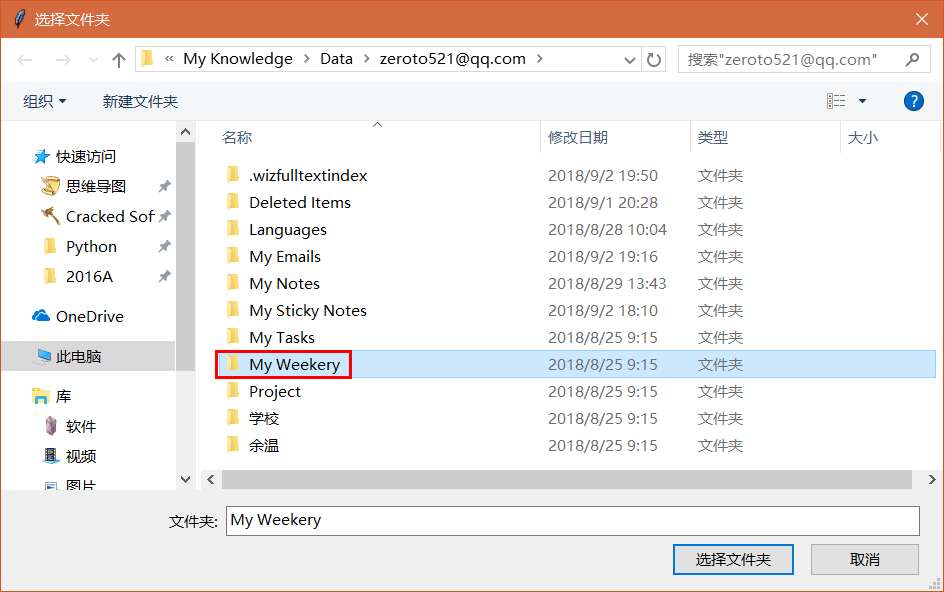
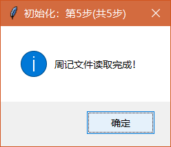

# WizStatistics

基于**wiz**用**Python**构建的时间记录软件。

## 截图

## 功能

## 如何使用

1. 安装[为知笔记](www.wiz.cn) 

2. 使用**周记模板**

   1. **新建**周记文件夹，**My Weekery**

   2. 在**My Weekery**文件夹里面，新建当前年份的文件夹，**2017**

	

   3. **下载**模板文件[WeekeryTemplate.wiztemplate](https://github.com/HowcanoeWang/WizStatistics/releases/download/Beta0.2/WeekeryTemplatev4.0.wiztemplate)并**导入**为知笔记
      
	

   4. 设置模板，点击模板文件在编辑界面点分享按钮另存为模板。

 

3. **使用模板**，进入**2017**文件夹，在新建笔记的**下拉菜单**中选择**周记模板**。

   > 新笔记名称**必须**修改成 **yy[mm.dd-mm.dd]Wno.** 例如：**17[11.06-11.12]W45**

4. 记录时间，下面是范例`^_^`

5. 运行 **stat_exercise.exe**

6. 选择周记文件夹**My Weekery**

7. **开始**周记之旅~

## TO DO

- [x] 时长展示
- [x] 图像界面
- [x] 睡眠分析
- [ ] 词频分析
- [ ] 官网制作
- [ ] 更新检查
- [ ] 自动化创建模板
- [ ] 功能设置